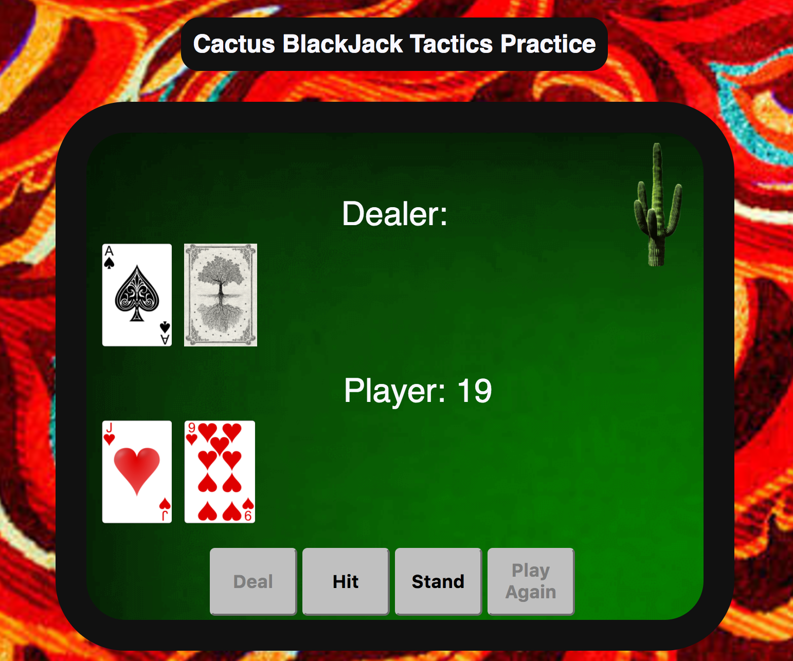
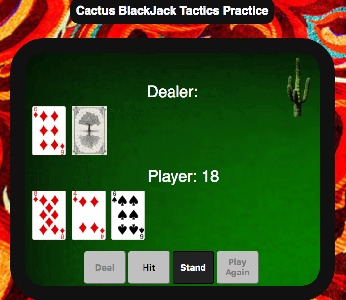
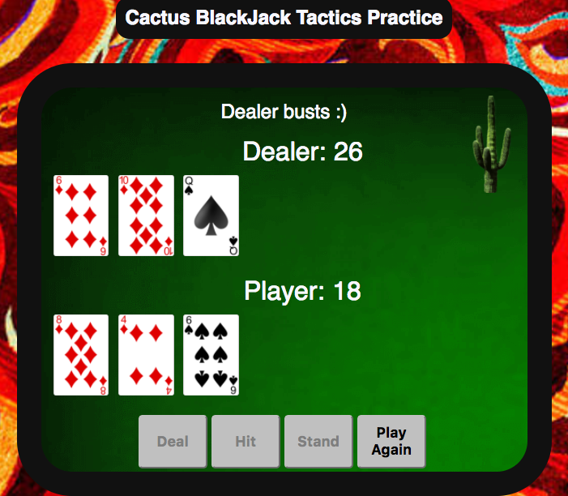
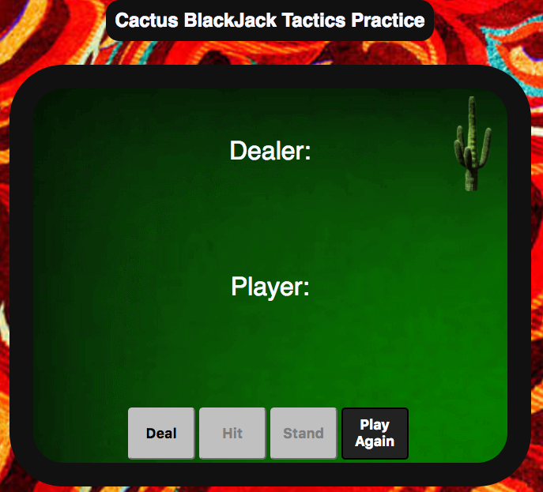

# Cactus Blackjack Tactics Practice
---
#### Objective:
Develop a blackjack practice game using object oriented programming (OOP) in javascript with all the tackiness of a real desert casino.
#### Live Demo:

[Cactus Blackjack](http://kirkabbott.com/blackjack/)

#### Languages used:

* HTML
* CSS
* Javascript
* jQuery

#### Authors:
Kirk Abbott

#### How to Play:

###### Game Rules
The goal is to beat the dealer with a better hand (meaning a hand totaling more than the dealer's hand, but not more than 21). The best hand the player can make is with any face card and an ace card, which would give the player 21 points (otherwise known as blackjack). If the player or the dealer's points total more than 21, then whoever reached that amount is automatically busted and loses the game. The dealer must also have at least 17 points by the end of the game. If the dealer's first two cards do not total at least 17, then the dealer must keep drawing more cards until reaching a minimum of 17 points.

1. Click on the deal button to get started (give the player and dealer 2 cards each. The dealer's 2nd drawn card does not show the face side. This card is known as the dealer's hole card. It will be shown later.)

  

2. Click on the hit button to draw another card (the choice is yours)

  
3. Click on the stand button when you do not want to draw anymore cards. If you've reached this point, that means you haven't busted and neither you or the dealer got a blackjack. At this point, the dealer's hole card is revealed. If the dealer's total points is below 17, then the dealer must draw more cards until reaching a minimum of 17

  

4. Click on the Play Again button to begin a new game

  

#### Sample Code:

- Below shows some of the methods that the Deck Constructor has

```
function Deck() {
  this.deck = [];
}

Deck.prototype.newDeckGenerator = function() {
  for (var i = 1; i <= 13; i++) {
    this.deck.push(new Card(i, "diamonds"));
    this.deck.push(new Card(i, "spades"));
    this.deck.push(new Card(i, "clubs"));
    this.deck.push(new Card(i, "hearts"));
  }
  console.log("NEW DECK OF CARDS BEING GENERATED: ");
  console.log(this.deck);
  console.log("Length of newly gnerated deck: " + this.deck.length);
};

Deck.prototype.draw = function() {
  console.log("current deck before being drawing a card: ");
  console.log(this.deck);

  var newCard = this.deck.pop();
  console.log("Drawn card: ");
  console.log(newCard);
  return newCard;
};

Deck.prototype.shuffle = function() {
  var i = 0, j = 0, temp = null;

  for (i = this.deck.length - 1; i > 0; i -= 1) {
    j = Math.floor(Math.random() * (i + 1));
    temp = this.deck[i];
    this.deck[i] = this.deck[j];
    this.deck[j] = temp;
  }
};

var myDeck = new Deck();
var dealerHand = new Hand();
var playerHand = new Hand();
```
- Below shows the hand constructor prototype "getPoints", taking into account the Ace counting for 1 or 11. It is called later for checking if player or dealer wins/loses/busts etc

```
function Hand() {
  this.cardArray = [];
}

 Hand.prototype.getPoints = function() {
   var length = this.cardArray.length;
   var counter = 0;
   var count_1 = false;

   var points = this.cardArray.reduce(function(totalPoints, card) {
     if (card.point > 10) {
       card.point = 10;
     }
     counter++;
     totalPoints += card.point;
     if (card.point === 1) {
       count_1 = true;
     }
     if (counter === length) {
       if (totalPoints <= 11 && count_1) {
         totalPoints += 10;
       }
     }
     console.log("total points: " + totalPoints);
     return totalPoints;
   }, 0);
   return points;
 };
```

- Below shows the checkWin function, called when a player stands

```
function checkWin() {

  if (playerHand.getPoints() === dealerHand.getPoints()) {
    $('#messages').text("It's a push :/");
  }
  else if (dealerHand.getPoints() > 21) {
    $('#messages').text('Dealer busts :)');
    console.log(dealerHand.getPoints());
  }
  else if (playerHand.getPoints() > 21 || dealerHand.getPoints() === 21 || (dealerHand.getPoints() > playerHand.getPoints())) {
    $('#messages').text('you lost :(');
  }
  else if (playerHand.getPoints() === 21) {
    $('#messages').text('You Win with 21! :)');
  }

  else if (playerHand.getPoints() > dealerHand.getPoints()) {
    $('#messages').text('You win :)');
  }
  $('#Play-Again-button').prop('disabled', false);
  console.log(dealerHand.getPoints());
}
```
